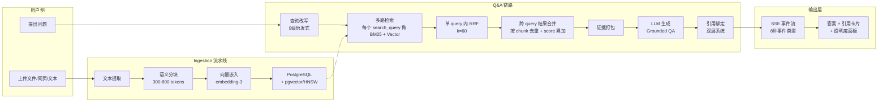
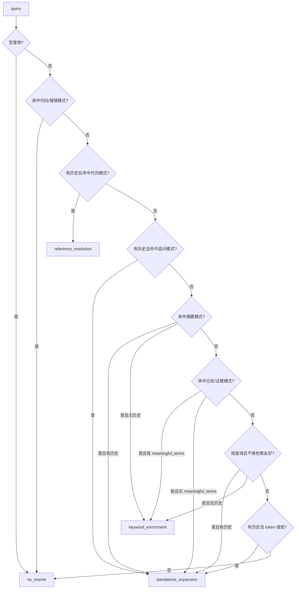
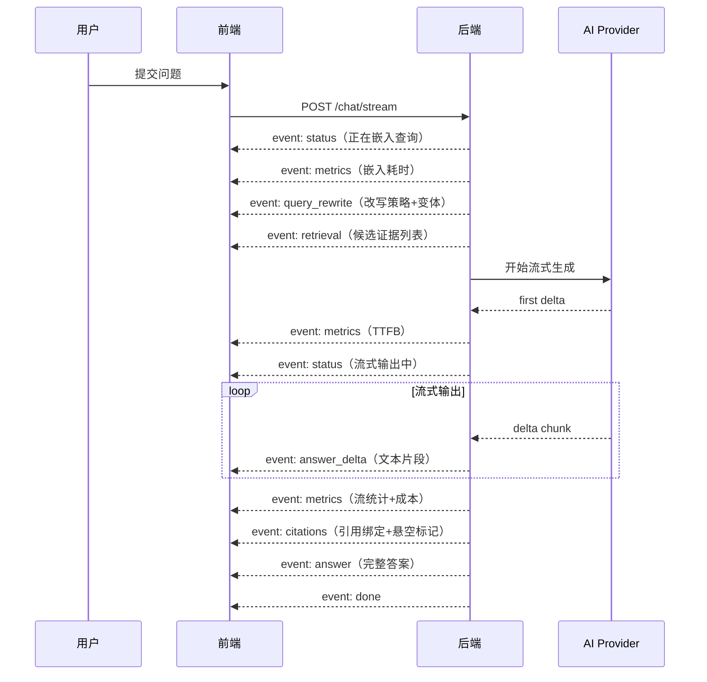

# NotebookLX：把 AI 从"会说"做成"可追溯、可审计、可复盘"的知识工作台（案例分享）

## 开场：一个真实的"AI 不可信"时刻

上周我用 ChatGPT 分析一份 120 页的上市公司年报。

它给了我一段关于营收增长的漂亮总结——数据精确到小数点后两位，逻辑完整得可以直接复制进报告。

直到我翻到原文第 47 页，发现那个 23% 的增长率根本不是全年数据，是 Q3 的季度环比。

AI 没有编造数字。它把第 47 页的季度数据和第 89 页的全年展望拼在一起，逻辑自洽地推导出了一个看起来最合理的结论。问题不是"说错了"——问题是我**完全无法追问**：这段结论引用了哪个表格？跨了哪几页？有没有遗漏关键限定条件？一概不可追溯。

那一刻我意识到：**"AI 很强但很难信"不是技术问题，是产品问题。** 如果 AI 不能展示它的证据链，它就不能被用在重要决策上。

NotebookLX 的起点就是把这句"凭什么"变成产品的第一原则：**让 AI 的每句话都能回到源文档的某一段、某一页、某一处证据上；让检索、改写、耗时、成本、引用绑定都不再是黑盒；让你不仅能拿到答案，还能拿到"答案的来路"。**

这篇分享不是"堆功能清单"，也不是"又一个 RAG demo"。我会用一篇可以直接当作案例研究的长文，把核心设计、关键参数、系统取舍和可复用的工程方法讲清楚。技术同学能抄作业，非技术同学也能看懂并愿意转发。

---

## 全景：从上传到答案，系统做了什么

用户视角很简单：上传文件 → 等一会 → 问问题 → 拿到带引用的答案。

系统视角是一条完整的数据加工链路：

```
上传 → 文本提取 → 语义分块 → 向量嵌入 → 入库索引
                                            ↓
提问 → 查询改写 → 多路检索(BM25+Vector+RRF) → 跨 query 结果合并 → 证据打包 → LLM生成 → 引用绑定 → SSE事件流
```

> **[FIGMA 手绘插图：架构全景]** — 从"用户上传"到"收到带引用答案"的完整数据流，突出 5 个关键决策节点



**技术栈架构速览：** 
```
Frontend: Next.js + Tailwind + shadcn/ui + SSE Client
    |
HTTP/SSE
    |
Backend: FastAPI
  - notebooks / sources / ingestion / chunking / embeddings
  - retrieval (BM25 + Vector + RRF; cross-query merge)
  - query rewrite
  - chat (grounded QA)
  - citations (evidence + binding)
    |
PostgreSQL + pgvector (HNSW)
Redis (Arq task queue)
MinIO/S3 (source objects)
AI Provider abstraction (ZhipuAI / OpenAI)
```

**隔离原则：** 所有检索、改写、回答硬性限定在 `notebook_id` 范围内——模型不能引用外部知识，不能混入训练记忆。每条结论的来源是可审计的。

为什么选这套栈？不追求"最炫最全"——每个组件的存在理由是：数据一致性、可观测、可追溯、可迭代。这些东西比"又接了一个模型"更能复用。

---

## 决策①：把材料变成可引用的证据

从用户角度看是"上传文件 → 等一会 → 能问问题"。系统角度看，这个"等一会"是一条 7 步可度量的流水线：

**保存原文件 → 文本提取 → 语义分块 → 向量嵌入 → 入库索引 → 快照生成 → 状态机(pending→processing→ready/failed)**

每一步都有耗时、错误类型、重试次数、成本。这是后续"透明度面板"和"评估仪表板"的基础。

### 语义分块

| 参数 | 选值 | 理由 |
|------|------|------|
| 切分策略 | 按段落/标题自然边界 | 优先语义完整，不用固定窗口硬切 |
| 目标块大小 | 300–800 tokens [1] | 兼顾"证据可读性"与"检索召回" |
| 相邻块重叠 | 50–120 tokens [2] | 降低边界处信息丢失 |
| 关键元数据 | 页码、标题层级、字符位置 | 为精确引用与 UI 定位服务 |

为什么不是更大或更小？太小：证据碎片化，引用多但上下文不够；太大：召回难、上下文贵、引用跳转体验差。**"能被人读懂的一段"是目标单位。**

### 嵌入与存储

| 参数 | 选值 |
|------|------|
| 嵌入模型 | embedding-3, 2048 维 |
| 批量大小 | 32 chunks/次，范围 1–100 |
| 重试 | 最多 3 次，指数退避 1.0s |
| 节流 | 120 req/min |
| 存储 | PostgreSQL + pgvector |
| 索引 | HNSW [3]，交互级检索延迟 |

取舍：牺牲向量专用库的极致性能，换来部署简单、事务一致性和工程可控。

---

## 决策②：从证据里找到相关的

单路检索的问题不是"不够好"，而是各有盲区：

- **BM25** 精确匹配术语——搜"pgvector HNSW 参数"能精准命中，但问"如何加速向量检索"一个关键词都匹配不上
- **Vector** 理解语义——"加速向量检索"能关联到"HNSW 索引优化"，但面对"ef_construction 参数"这种精确查询，可能把"参数"关联到无关文档的"函数参数"

两路盲区刚好互补。问题只剩一个：**怎么合并？**

### 同一个查询，5 种方案的排名对比

用户搜"HNSW 索引参数优化"，系统返回 3 个候选 chunk：

| | chunk_A（参数文档原文） | chunk_B（算法原理讨论） | chunk_C（使用指南） |
|--|--|--|--|
| Vector 得分 | 0.62 | **0.95** | 0.45 |
| BM25 得分 | **0.92** | 0.30 | 0.70 |
| Vector 排名 | #2 | #1 | #3 |
| BM25 排名 | #1 | #3 | #2 |

chunk_A 是关键词冠军，chunk_B 是语义冠军。谁该排第一？

| 方案 | #1 | #2 | #3 | 说明 |
|------|-----|-----|-----|------|
| BM25 only | A | C | B | 关键词冠军 |
| Vector only | B | A | C | 语义冠军 |
| 加权 vec **0.7** + bm25 0.3 | B | A | C | 排名和纯 Vector **一模一样** |
| 加权 vec 0.3 + bm25 **0.7** | A | C | B | 排名和纯 BM25 **一模一样** |
| **RRF（k=60）** | **A** | **B** | **C** | **两路都认可的** |

加权融合的排名只是跟着权重偏向的那路走——权重没有"融合"，只是在"选边"。**RRF 选出了 A：它 Vector #2、BM25 #1，两路都给高位；B 虽然 Vector #1 但 BM25 #3——单路冠军被两路都认可的 A 反超。**

RRF 公式：不看原始分数，只看排名 [4]

```
score(d) = Σ 1 / (k + rank_i(d))     k = 60
```

- chunk_A：1/(60+2) + 1/(60+1) = **0.0325**（两路高位 → 得分最高）
- chunk_B：1/(60+1) + 1/(60+3) = 0.0323（一路 #1 但另一路 #3）
- chunk_C：1/(60+3) + 1/(60+2) = 0.0320（两路居中）

不需要权重调参，不需要分数归一化，不需要知道两路绝对分数是否可比。**只奖励"多方印证"——两路同时指向同一段证据，它大概率就是你需要的。**

参数：`k=60`（平滑排名波动）、两路各取 2×top_k=20 条候选、融合截断到 top_k=10、耗时 < 300ms。

---

## 决策③：理解用户真正想问什么

大部分 RAG 系统对待用户问题的态度是"一律发给 LLM 重写"。我们做了一件看起来吃亏但很赚的事：**在调 LLM 之前，先用纯规则筛掉不需要改写的查询。**

- 策略：9 级启发式规则瀑布优先筛掉不需要改写的查询，以 regex 为主、叠加少量长度与可检索性判断，零额外 LLM 成本，LLM 仅在启发式判定需要时兜底，优点是延迟低，适合当前查询明确、资源有边界和行为确定的系统；如果意图复杂、包含创意性重述，则应该优先考虑 LLM；
- 4 种 query 改写方案：`no_rewrite`（不改）/ `reference_resolution`（代词消解）/ `standalone_expansion`（独立展开）/ `keyword_enrichment`（关键词补全）
- 常见触发：英文代词（`it/this/that/they`）、追问（`what about` / `how about`）、短查询，以及中英混合的摘要/比较/证据类关键词
- 产出：1 个独立查询 + 最多 3 个检索变体 → 多路检索合并，提升召回覆盖
- 安全网：`_preserves_protected_terms()` 检查——改写不能丢掉原文专有名词（如"pgvector"），否则拒绝回退
- 价值：少调一次 LLM = 少一笔成本 + 少一次延迟；策略可解释、可展示、可复盘


核心判断：**如果查询本身已经足够清晰，改写就是浪费。**

### 9 级启发式瀑布（以 regex 为主的规则瀑布，零额外 LLM 成本）



可以把它理解成一句话：**先排除“本来就适合检索”的 query，再识别“必须补上下文”的 query，最后才处理“短而模糊”的 query。**

触发信号主要来自几组 regex，再叠加少量长度/可检索性规则：

- `CODE_OR_ERROR_PATTERN`：命中反引号代码、`foo()`、路径/文件名、`ValueError`/`Exception`、`Traceback` 之类调试信号时，直接 `no_rewrite`，因为这类 query 通常已经比自然语言更像检索关键词。
- `PRONOUN_PATTERN` + 历史消息：命中 `it/this/that/they/he/she...` 这类英文代词时，走 `reference_resolution`，本质是在补“它到底指谁”。
- `FOLLOW_UP_PATTERN` + 历史消息：命中 `what about`、`how about`、`where is that mentioned` 之类追问句式时，走 `standalone_expansion`，把上下文折叠进独立问题。
- `SUMMARY_PATTERN`：命中 `summarize/summary/overview/tl;dr` 或“总结一下/概括”时，如果有上下文就展开成独立问题，没有上下文就补摘要类检索词。
- `COMPARISON_PATTERN` / `EVIDENCE_PATTERN`：命中 `compare/vs/difference`、`where/mention/source/quote` 或“区别/对比/哪里提到/有没有说”时，优先走 `keyword_enrichment`，因为这类问题通常缺的是检索词，不是主语。
- 长度与可检索性规则：`token_count <= short_query_token_threshold` 且 `_looks_search_friendly(query)` 为假时，说明 query 太短、主题不稳，需要补全；如果又有历史消息，默认按 follow-up 处理。

所以这不是“模型先理解，再决定要不要改写”，而是**规则先判断“值不值得改写”**。只有真的需要补上下文、补关键词时，才把 LLM 拉进来。

### 为什么这么设计？三个理由

**1) 省钱省时。** 正则匹配纳秒级；LLM 百毫秒级 + 按 token 计费。"pgvector 怎么建 HNSW 索引"——关键词明确，直接检索；"它怎么用"——代词"它"指什么？必须改写。大部分输入属于前者，跳过就是省钱。

**2) 可解释。** "检测到代词 → 执行代词消解"比"模型认为需要改写"容易复盘。策略在透明度面板实时展示：原始问题、选择的策略、检索变体，全部对用户可见。

**3) 安全网。** 即使 LLM 做了改写，系统也不允许它改丢主题锚点。`_extract_protected_terms()` 的核心不是精确识别“专有名词”，而是**宽松提取所有可能决定检索命中的技术 token**：先保留反引号包裹内容，再用 `TOPIC_TOKEN_PATTERN` 抓取**字母开头、长度至少 3、可含数字和 `_ . : / -`** 的标识符式 token，所以 `pgvector`、`HNSW`、`config.yaml`、`api/v1`、`C:Windows` 这类变量名、文件名、路径、协议名、版本串都会进入候选集；随后只剔除停用词和通用查询词，并做大小写无关去重。实现效果几乎等价于：**受保护词 = 技术 token 候选集 - 通用词**。接着 `_preserves_protected_terms()` 用这组词反查改写结果：允许改句式、补上下文、扩检索词，但不允许删掉主题 token；一旦缺词，整次改写直接作废。

"pgvector 建索引的参数"如果被改写丢掉了"pgvector"，系统直接拒绝——防止改写好心办坏事。

### 改写产出：一次改写，多路召回

不是 1 个查询，而是 **1 个独立问题 + 最多 3 个检索变体**。每条检索变体各自走一遍 BM25+Vector+RRF，产出结果后再按 `chunk_id` 合并。用户说"这个方案的风险"，系统不仅理解"这个"指什么，还同时检索"方案风险分析"、"风险评估"、"潜在问题"。一次输入，多路覆盖。

---

## 决策④：证明答案用了哪些证据

我们把引用拆成两层，因为它们回答的是两个不同的问题：

> **[FIGMA 手绘插图：双层引用系统]** — 左侧"Evidence Layer"（候选证据池），右侧"Binding Layer"（答案语句与证据的连线），中间箭头关联，突出"找到 ≠ 用到"

**Layer 1：检索证据层（Evidence Layer）**
- 回答"系统找到了哪些材料"
- 候选 chunks 列表：来源、页码、相关度分数、原文片段

**Layer 2：答案绑定层（Binding Layer）**
- 回答"答案这句话依据的是哪段材料"
- LLM 输出结构化 `answer_blocks`，每个文本块关联 `citation_chunk_ids`
- 后端把 chunkId 映射为 UI 引用标记 `[1][2][3]...`

为什么需要第二层？**仅有检索列表并不能证明"答案用到了什么"。** 你需要的是"这句话 → 这段证据"的映射。映射一旦建立，产品体验从"我相信你检索到了"跃迁到"我确认你引用了" [6]。

还有一个容易被忽略的保障：当 LLM 在答案中写了 `[4]` 但后端在证据池里找不到对应 chunk 时，`missing_citation_indices` 会显式标记这个悬空引用。**等于系统主动告诉你："这句话我没找到证据。"**

---

## 决策⑤：让用户看见全部过程

大部分聊天产品把 SSE 当"逐字输出"用。我们把 SSE 做成了**结构化事件流**——一次对话推送 8 种事件类型，每个携带独立的结构化数据。

### SSE 事件时序



### 后端核心只有一行

```python
def _format_sse_event(event: str, data: dict) -> str:
    return f"event: {event}\ndata: {json.dumps(data, ensure_ascii=False)}\n\n"
```

但它推送的是一整条"决策链 X 光"：

```
event: status        → 正在嵌入查询
event: metrics       → 嵌入 0.12s · 检索 0.34s · 模型 gpt-4o-mini
event: query_rewrite → "它的核心结论？" → 独立展开 → "这篇文档的核心结论是什么？"
event: retrieval     → 8 条候选 · 来自 3 个 source · 最高分 0.89
event: answer_delta  → 根据文档内容，
event: answer_delta  → 公司全年营收增长23%[1]
event: metrics       → TTFB 1.23s · 流 3.45s · 42 chunks · 成本 $0.002
event: citations     → [1] 年报.pdf p.12 · [2] 季报.pdf p.5 · 悬空引用 [4] 已标记
event: done          → complete
```

任何一个阶段出错，推送 `error` 事件（含 `retryable` 标记），**不中断连接**。

### 透明度面板：4 层信息

> **[FIGMA 手绘插图：透明度面板]** — 模拟 UI 面板截图，四个区块：查询改写、计时用量、检索证据、引用来源

前端 TypeScript 类型定义——每个事件、每个字段都有强类型接口：

```typescript
// apps/web/lib/chat-stream.ts
interface ChatMetricsEvent {
  query_embedding_seconds?: number;     // 嵌入耗时
  retrieval_seconds?: number;           // 检索耗时
  time_to_first_delta_seconds?: number; // 首 token 延迟（TTFB）
  prompt_tokens?: number;               // LLM 输入 token
  completion_tokens?: number;           // LLM 输出 token
  estimated_cost_usd?: number;          // 估算成本
}
interface ChatQueryRewriteEvent {
  original_query: string;               // 用户原话
  strategy: string;                     // 改写策略
  search_queries: string[];             // 检索变体
  rewritten: boolean;                   // 是否改写
}
interface ChatRetrievalEvent {
  chunk_count: number;                  // 候选数量
  source_count: number;                 // 涉及 source 数
  chunks: ChatCitation[];               // 每个 chunk 详情
}
interface ChatCitationsEvent {
  citations: ChatCitation[];            // 实际引用的 chunks
  citation_indices: number[];           // 已绑定引用编号
  missing_citation_indices: number[];   // 悬空引用
}
```

**① 查询改写层：** 原始问题 → 策略 → 检索变体。用户问"它的风险"，面板展示：策略 `standalone_expansion`，独立问题"这篇文档的风险分析是什么？"变体 `["风险分析","风险评估","潜在问题"]`。改写不再是黑盒。

**② 计时用量层：** 嵌入 0.12s、检索 0.34s、首 token 1.23s、总流 3.45s、prompt 3842 tokens、估算成本 $0.002。精确到小数点后两位。**渐进式推送——嵌入完成出嵌入指标，流结束出流指标，不等到最后。**

**③ 检索证据层：** 8 条候选来自 3 个 source，每条带页码、分数、原文引用。用户能看到"系统找来了什么"，而不只是"系统给了什么"。

**④ 引用来源层：** 答案实际用了哪些证据，以及——`missing_citation_indices`——哪些引用标记了但找不到对应证据。

**为什么这些细节重要？** 用户遇到"回答不满意"时，不再只能说"你错了"，而能说"你引用的证据不对 / 漏了某个 source / 改写把关键词丢了"。系统优化从"拍脑袋调参"变成"带证据的迭代"。

---

## 和通用方案有什么不同

| 维度 | 通用聊天 (ChatGPT 等) | 传统 RAG | **NotebookLX** |
|------|----------------------|----------|----------------|
| 知识边界 | 无——模型自由发挥 | 声称限定文档 | **硬性限定 notebook_id** |
| 引用深度 | 无或弱 | 单层（"我找到了这些"） | **双层（"我用了这些，这句话用了那段"）** |
| 检索透明 | 黑盒 | 黑盒 | **全链路公开（策略/耗时/成本/候选集）** |
| 幻觉检测 | 无 | 无 | **悬空引用标记** `missing_citation_indices` |
| 改写可解释 | N/A | 交给 LLM 黑盒 | **9 级启发式，策略实时展示** |
| 成本可见 | 无 | 无 | **每次对话展示 token 数 + 估算成本** |
| 适合场景 | 日常对话/创意写作 | 企业知识库/客服 | **深度研究/投研/学术/决策支持** |

差异不在"用了什么模型"，而在**系统设计的价值取向**：你选"让 AI 尽量说得漂亮"，还是"让 AI 能出示证据"。

---

## 实战：一次完整问答长什么样

**场景：投研分析师审阅 120 页上市公司年报**

用户提问："公司全年营收增长的核心驱动力是什么？风险因素有哪些？"

### Step 1：查询改写

```
原始问题: "公司全年营收增长的核心驱动力是什么？风险因素有哪些？"
策略判定: keyword_enrichment（关键词明确，无需 LLM 改写，零成本）
检索变体: ["全年营收增长 驱动因素", "营收增长 核心动力", "风险因素 不确定性"]
```

### Step 2：混合检索（单 query 用 RRF，多 query 做结果合并）

```
BM25 至多 20 条 · Vector 至多 20 条（top_k=10）
单 query 内 RRF(k=60) → 多 query 结果合并 → 截断取 top 10
耗时: 0.28s · 涉及 3 个 source
```

真实代码里，这里其实分成两层：

- 单个 `search_query` 的 **BM25 + Vector** 融合，发生在 `retrieval/hybrid.py`，使用 RRF。
- 多个改写后的 `search_queries` 返回结果后，再由 `chat/service.py` 中的 `merge_retrieval_results()` 做第二次合并。

`merge_retrieval_results()` 的核心逻辑不是再跑一遍 RRF，而是：

- 以 `chunk_id` 去重
- 对同一 chunk 在不同 query 下的 `score` 直接累加
- `vector_score` / `bm25_score` 保留更高的那一次
- 最后按合并后的 `score` 倒序排序并截断 `top_k`

核心代码片段如下：

```python
def merge_retrieval_results(
    result_sets: list[list[HybridSearchResult]],
    *,
    top_k: int,
) -> list[HybridSearchResult]:
    if not result_sets:
        return []

    if len(result_sets) == 1:
        return result_sets[0][:top_k]

    merged_by_chunk: dict[str, HybridSearchResult] = {}

    for results in result_sets:
        for result in results:
            existing = merged_by_chunk.get(result.chunk_id)
            if existing is None:
                merged_by_chunk[result.chunk_id] = HybridSearchResult(
                    chunk_id=result.chunk_id,
                    source_id=result.source_id,
                    notebook_id=result.notebook_id,
                    content=result.content,
                    score=result.score,
                    vector_score=result.vector_score,
                    bm25_score=result.bm25_score,
                    vector_rank=result.vector_rank,
                    bm25_rank=result.bm25_rank,
                    metadata=dict(result.metadata or {}),
                    source_title=result.source_title,
                    chunk_index=result.chunk_index,
                )
                continue

            existing.score += result.score
            if result.vector_score is not None and (
                existing.vector_score is None or result.vector_score > existing.vector_score
            ):
                existing.vector_score = result.vector_score
                existing.vector_rank = result.vector_rank
            if result.bm25_score is not None and (
                existing.bm25_score is None or result.bm25_score > existing.bm25_score
            ):
                existing.bm25_score = result.bm25_score
                existing.bm25_rank = result.bm25_rank

    merged_results = sorted(
        merged_by_chunk.values(),
        key=lambda result: result.score,
        reverse=True,
    )
    return merged_results[:top_k]
```

### Step 3：证据包组装 → LLM 流式生成 → 引用绑定

检索产出的 10 条候选 chunks 被打包成**证据包（Evidence Pack）**，编号后注入 LLM prompt：

```python
# services/api/modules/chat/service.py — 每条证据的三行格式
for chunk in evidence:
    page_part = f", page {chunk.page}" if chunk.page else ""
    evidence_lines.append(
        f"[{chunk.citation_index}] {chunk.source_title}{page_part}\n"
        f"Quote: {chunk.quote}\n"
        f"Content: {chunk.content}"
    )
```

LLM 收到的完整 prompt：

```
System: You answer questions using only the evidence provided.
        If the evidence does not support the answer, clearly say
        that you do not have enough information.
        Respond in Simplified Chinese. Keep citation markers [1][2]...

User:   Answer the question using only the evidence below.

        Question: 公司全年营收增长的核心驱动力是什么？风险因素有哪些？

        Evidence:
        [1] 2024年年度报告, page 23
        Quote: 公司全年实现营业收入328.5亿元，同比增长18.3%...
        Content: <完整 chunk 文本，约 500 tokens>

        [2] 2024年年度报告, page 25
        Quote: 核心产品线收入同比增长24.7%，占总收入比重达67%...
        Content: <完整 chunk 文本>

        ...（共 10 条，按 RRF 融合分数倒序排列）

        Cite claims inline with markers like [1][2].
        Do not add facts that are not present in the evidence.
```

**双重硬约束，不是建议。** `only the evidence provided` + `Do not add facts` 构成证据边界。如果证据不足以回答，LLM 被要求明确说"信息不足"——而不是编造。系统会根据用户语言自动切换中文/英文回答指令。

**流式输出——从第一个 token 开始用户就能看到答案在长出来：**

```
event: status        → waiting_model（等待首 token）
event: metrics       → TTFB: 1.05s（首 delta 到达，计时精确到小数点后两位）
event: status        → streaming（流式输出中）
event: answer_delta  → 根据年报披露，公司全年实现营业收入 328.5 亿元，
event: answer_delta  → 同比增长 18.3%[1]。增长主要来自三方面：
event: answer_delta  → 一是核心产品线收入增长 24.7%[2]；
event: answer_delta  → 二是新市场拓展贡献增量收入 45.2 亿元[3]；
event: answer_delta  → 三是海外业务收入增长 31.2%[4]。
event: answer_delta  → 主要风险因素包括：行业竞争加剧[5]；
event: answer_delta  → 原材料价格波动[6]；
event: answer_delta  → 以及汇率风险和地缘政治不确定性[7]。
...（42 个 delta chunks，总流 4.12s）
event: metrics       → llm_stream: 4.12s · 42 chunks · completion: 623 tokens · 成本 $0.003
```

**引用绑定——后端对 LLM 输出的"交叉审计"**

LLM 流结束不代表完成。`finalize_grounded_answer` 对拼好的完整答案执行引用校验——不是把 LLM 输出直接交给用户，而是一次主动的"证据链核实"：

```python
# 1. 从 LLM 输出中提取所有 [N] 标记
def _extract_inline_citations(answer: str) -> list[int]:
    for match in re.finditer(r"\[(\d+)\]", answer):
        index = int(match.group(1))
        ...

# 2. 用证据池做交叉验证
evidence_by_index = {chunk.citation_index: chunk for chunk in evidence}
citations = [evidence_by_index[i] for i in indices if i in evidence_by_index]
missing    = [i for i in indices if i not in evidence_by_index]  # 悬空引用
```

三种结果：

| 引用标记 | 证据池中有对应 chunk？ | 处理方式 |
|----------|----------------------|----------|
| [1][2][5] | **有** | → 写入 `citations`，前端渲染为可点击卡片，展示原文、页码、分数 |
| [7] | **没有** | → 写入 `missing_citation_indices`，前端标黄警告"悬空引用" |
| 无标记的陈述 | — | → 用户应视为"无证据支撑"，自行降低信任权重 |

**如果检索阶段返回零证据，系统直接跳过 LLM 调用**，返回"我没有足够的信息来回答这个问题"。**宁可不说，不瞎说。** 这是"真相边界"的最后一道闸门。

### Step 4：引用卡片——从"相信我"到"自己看"

`citations` 事件推送到前端后，答案文本按 `(\[\d+\])` 正则切分——每个 `[N]` 变成可点击的 `CitationMarker` 按钮，点击后展开完整引用卡片：

```typescript
// apps/web/components/chat/message-bubble.tsx — 答案渲染核心
const segments = content.split(/(\[\d+\])/g).filter(Boolean);
segments.map((segment) => {
  const match = /^\[(\d+)\]$/.exec(segment);
  if (!match) return <span>{segment}</span>;                    // 普通文本
  const idx = Number(match[1]);
  if (!citationIndexSet.has(idx)) return <span>{segment}</span>; // 悬空标记
  return <CitationMarker index={idx} onSelect={onCitationSelect} />; // 可点击
});
```

点击后展开的卡片内容——每个字段都来自 `EvidenceChunk` 数据结构的真实字段：

```
┌─ [1] ─────────────────────────────────────────────┐
│  📄 2024年年度报告 · page 23 · chunk #4/87         │
│                                                    │
│  "公司全年实现营业收入328.5亿元，同比增长18.3%。      │
│   其中核心产品线贡献收入220.8亿元..."                 │
│                                                    │
│  相关度: 0.92  ·  chunk_id: a3f8c...               │
└────────────────────────────────────────────────────┘

┌─ [5] ─────────────────────────────────────────────┐
│  📄 2024年年度报告 · page 67 · chunk #52/87        │
│                                                    │
│  "主要风险因素包括行业竞争加剧导致的毛利率承压，       │
│   原材料价格波动影响成本稳定性..."                    │
│                                                    │
│  相关度: 0.91  ·  chunk_id: c7d2e...               │
└────────────────────────────────────────────────────┘

⚠️  [7] 悬空引用 — LLM 在答案中写入了标记 [7]，但后端在证据池中
         未找到对应 chunk。系统主动暴露此异常，而非隐瞒。
```

**每张卡片回溯到完整的 `EvidenceChunk` 结构：**

```python
@dataclass(frozen=True)
class EvidenceChunk:
    citation_index: int      # 显示编号 [1], [2]...
    chunk_id: str            # 数据库 UUID → 可跳转到源文档精确位置
    source_title: str        # "2024年年度报告"
    page: str | None         # 精确页码（PDF 专属）
    quote: str               # 原文片段（自动截取前 220 字符）
    content: str             # 完整 chunk 文本（300-800 tokens）
    score: float             # RRF 融合后的相关度分数
    source_id: str | None    # 源文档 UUID
    chunk_index: int | None  # 在源文档中的第几个分块
```

**这就是"可追溯"的完整闭环：** 用户看到 `[1]` → 点击 → 看到原文片段、页码、相关度分数 → 知道来自哪个文档的哪个位置 → 可以回到原文验证。如果引用是悬空的，系统不假装它有效——直接标黄。**没有任何一个引用标记是装饰性的。** 它们要么有证据支撑，要么被标记为缺失。这不是"AI 引用了某些资料"，这是"AI 为每一句结论出示了证据，并为没有证据的结论挂了警告牌"

### Step 5：透明度面板

```
嵌入: 0.11s · 检索: 0.28s · TTFB: 1.05s · 总流: 4.12s
Prompt: 4,231 tokens · Completion: 623 tokens · 估算成本: $0.003
```

**注意 [7] 的悬空标记**——LLM 提到了"汇率风险和地缘政治不确定性"但证据池里没有足够强的支撑。系统没有隐瞒，直接暴露。这就是"可追溯"和"看起来可追溯"的区别。

---

## 写在最后：从"凭什么"到"看证据"

回到开头的场景。

如果当时我用的是 NotebookLX，那段关于营收增长的总结会带上 `[1][2][3]` 的引用标记，每个标记可点击跳转到年报对应页面。如果 AI 把季度数据和全年数据混在一起，我能从引用卡片中一眼看到——因为页码和原文片段就在那里。

**这套设计带来的三个可量化变化：**

1. **可信度可验证** — 每条结论都能回到源文档的页码和段落。不是"我觉得 AI 说的对"，而是"我确认引用在这里"。
2. **排障可定位** — 回答不好时，你能指出是检索不准、改写丢了关键词、还是引用绑定遗漏。而不是笼统的"AI 不行"。
3. **成本可感知** — 每次对话展示 token 数和估算成本。"AI 便宜/贵"从模糊感觉变成具体数字。

**谁会特别适合：**

- **技术同学**（架构/后端/算法）— "真相边界 + 双层引用 + 透明度 UX"是一个可复用的产品范式；参数表可以直接当起步配置。
- **非技术同学**（研究/投研/产品/学生）— 一个"不会把你带沟里"的 AI：答案能回到资料里验证；散落的材料能沉淀成可检索、可追问的知识工作台。

**路线图：** 可追溯问答站稳之后，下一步是自动摘要与主题提取、推荐问题/FAQ/学习指南、源文档交叉分析、Reranker 集成与评估流水线、权限与协作。

**工程方法论：** TDD + 文档驱动（`DEVELOPMENT_PLAN.md` / `TASK_CHECKLIST.md`）保证项目不止能演示，还能持续演进。如果你也在做 RAG/知识库/Agent 项目，**"测试驱动 + 可观测性 + 验收标准文档化"往往比"换个更强模型"更能决定项目能不能走到生产。**

我们正处在一个"AI 很强但很难信"的时代。真正能落地的 AI 产品，靠的不是更会说，而是更能把"说的依据"交到你手上。

---

## 附录 A：参数速查表

> 以下参数不是"唯一正确"，但是在"可追溯体验、成本、延迟、实现复杂度"之间的可解释取舍，足够当作起点。

### 分块（Chunking）

| 参数 | 值 |
|------|-----|
| 策略 | 按段落/标题自然边界 |
| 目标大小 | 300–800 tokens |
| 相邻重叠 | 50–120 tokens |
| 元数据 | 页码、标题层级、字符位置 |

### 嵌入（Embedding）

| 参数 | 值 |
|------|-----|
| 模型 | embedding-3, 2048 维 |
| 批量大小 | 32 chunks/次（1–100） |
| 重试 | 3 次，指数退避 1.0s |
| 节流 | 120 req/min |

### 检索（Retrieval）

| 参数 | 值 |
|------|-----|
| 方法 | BM25 + Vector + RRF |
| RRF k | 60 |
| 候选 | 两路各 2×top_k = 20 |
| 输出 | top_k = 10 |
| 延迟目标 | < 300ms |

### 查询改写（Query Rewrite）

| 参数 | 值 |
|------|-----|
| 策略 | 4 种（no_rewrite / reference_resolution / standalone_expansion / keyword_enrichment） |
| 启发式规则 | 9 级 |
| 检索变体 | 1 独立问题 + 最多 3 变体 |
| LLM 兜底 | 仅启发式判定需要时调用 |
| 安全网 | protected_terms 检查 |

---

## 附录 B：参考资料

- **[1] 语义分块甜点区间：** [Pinecone: Chunking Strategies](https://www.pinecone.io/learn/chunking-strategies/) · [OpenAI Cookbook: RAG Quickstart](https://github.com/openai/openai-cookbook)
- **[2] 重叠窗口：** [LangChain: Text Splitters](https://python.langchain.com/docs/modules/data_connection/document_transformers/) · [LlamaIndex: Basic RAG Strategies](https://docs.llamaindex.ai/en/stable/optimizing/basic_strategies/)
- **[3] HNSW 算法：** [Malkov & Yashunin (2018)](https://arxiv.org/abs/1603.09320) · [pgvector: HNSW Reference](https://github.com/pgvector/pgvector#hnsw)
- **[4] RRF 融合策略：** [Cormack et al. (2009)](https://dl.acm.org/doi/10.1145/1571941.1572114) · [Elasticsearch: RRF Guide](https://www.elastic.co/guide/en/elasticsearch/reference/current/rrf.html)
- **[5] RAG 幻觉抑制：** [Lewis et al. (2020)](https://arxiv.org/abs/2005.11401) · [Gao et al. (2023) Survey](https://arxiv.org/abs/2312.10997)
- **[6] 归因与引用评价：** [Gao et al. (2023): ALCE](https://arxiv.org/abs/2305.14627) · [Princeton-NLP/ALCE](https://github.com/princeton-nlp/ALCE)
